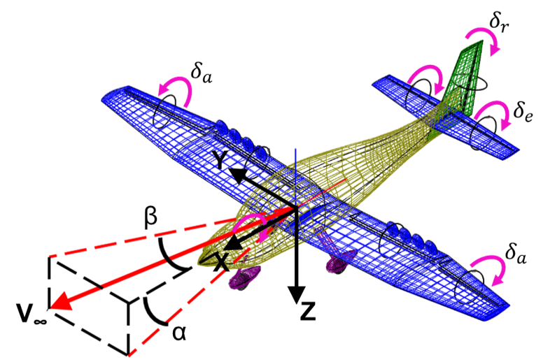

# ADEPT-FC Autopilot Validation Procedure
*Grayson Schaer\
Bretl Research Group\
Aerodynamics and Unsteady Flow Group\
ESAero\
Created: 10/29/2020 13:50 CST\
Updated: 10/30/2020 11:19 CST*

---
## Unit Tests
_This section will describe the purpose, scope, and procedure relating to the autopilot unit tests._

**Purpose**

Unit tests are conducted to ensure:
1. All PWM input commands given by the autopilot are within an acceptable range and will not damage the physical servos.
2. Autopilot state rejection performs as expected.
3. Input commands calculated by the autopilot are in the expected direction.

These tasks are achieved by intercepting the states observed by the 5-hole probe and INS and replacing them with a set of test states. In total, 21 states are tested. The expected inputs are based on optimal controller simulation. The test points include:
1. Rejection of too negative state
  - *Expected behavior:* All state variables rejected. Replaced by last known good state (trim state)
  - *Expected input:* Trim input on all input axes.
2. Rejection of too large state
  - *Expected behavior:* All state variables rejected. Replaced by last known good state (trim state)
  - *Expected input:* Trim input on all input axes.
3. Positive pitch
  - *Expected behavior:* No state variables rejected.
  - *Expected input:* Trim input on aileron and rudder. **IF CONTROLLED**, positive inputs from elevator and throttle. **ELSE**, trim.
4. Negative pitch
  - *Expected behavior:* No state variables rejected.
  - *Expected input:* Trim input on aileron and rudder. **IF CONTROLLED**, negative inputs from elevator and throttle. **ELSE**, trim.
5. Positive roll
  - *Expected behavior:* No state variables rejected.
  - *Expected input:* Trim input on elevator. **IF CONTROLLED**, negative inputs from aileron, rudder, and left throttle. Positive inputs from right throttle. **ELSE**, trim.
6. Negative roll
  - *Expected behavior:* No state variables rejected.
  - *Expected input:* Trim input on elevator. **IF CONTROLLED**, positive inputs from aileron, rudder, and left throttle. Negative inputs from right throttle. **ELSE**, trim.
7. Positive yaw
  - *Expected behavior:* No state variables rejected.
  - *Expected input:* Trim input on elevator. **IF CONTROLLED**, negative inputs from aileron and left throttle. Positive inputs from rudder and right throttle. **ELSE**, trim.
8. Negative yaw
  - *Expected behavior:* No state variables rejected.
  - *Expected input:* Trim input on elevator. **IF CONTROLLED**, positive inputs from aileron and left throttle. Negative inputs from rudder and right throttle. **ELSE**, trim.
9. Positive pitch rate
  - *Expected behavior:* No state variables rejected.
  - *Expected input:* Trim input on aileron and rudder. **IF CONTROLLED**, positive inputs from elevator and throttle. **ELSE**, trim.
10. Negative pitch rate
  - *Expected behavior:* No state variables rejected.
  - *Expected input:* Trim input on aileron and rudder. **IF CONTROLLED**, negative inputs from elevator and throttle. **ELSE**, trim.
11. Positive roll rate
  - *Expected behavior:* No state variables rejected.
  - *Expected input:* Trim input on elevator. **IF CONTROLLED**, negative inputs from aileron, rudder, and left throttle. Positive inputs from right throttle. **ELSE**, trim.
12. Negative roll rate
  - *Expected behavior:* No state variables rejected.
  - *Expected input:* Trim input on elevator. **IF CONTROLLED**, positive inputs from aileron, rudder, and left throttle. Negative inputs from right throttle. **ELSE**, trim.
13. Positive yaw rate
  - *Expected behavior:* No state variables rejected.
  - *Expected input:* Trim input on elevator. **IF CONTROLLED**, positive inputs from aileron, rudder, and right throttle. Negative inputs from left throttle. **ELSE**, trim.
14. Negative yaw rate
  - *Expected behavior:* No state variables rejected.
  - *Expected input:* Trim input on elevator. **IF CONTROLLED**, negative inputs from aileron, rudder, and right throttle. Positive inputs from left throttle. **ELSE**, trim.
15. Positive angle of attack
  - *Expected behavior:* No state variables rejected.
  - *Expected input:* Trim input on aileron and rudder. **IF CONTROLLED**, negative input from elevator, positive input from throttle. **ELSE**, trim.
16. Negative angle of attack
  - *Expected behavior:* No state variables rejected.
  - *Expected input:* Trim input on aileron and rudder. **IF CONTROLLED**, positive input from elevator, negative input from throttle. **ELSE**, trim.    
17. Positive sideslip angle
  - *Expected behavior:* No state variables rejected.
  - *Expected input:* Trim input on elevator. **IF CONTROLLED**, negative input from aileron, rudder, and right throttle. Positive input from left throttle. **ELSE**, trim.
18. Negative sideslip angle
  - *Expected behavior:* No state variables rejected.
  - *Expected input:* Trim input on elevator. **IF CONTROLLED**, positive input from aileron, rudder, and right throttle. Negative input from left throttle. **ELSE**, trim.   
19. Positive velocity
  - *Expected behavior:* No state variables rejected.
  - *Expected input:* Trim input on aileron and rudder. **IF CONTROLLED**, negative inputs from elevator and throttle. **ELSE**, trim.
20. Negative velocity
  - *Expected behavior:* No state variables rejected.
  - *Expected input:* Trim input on aileron and rudder. **IF CONTROLLED**, positive inputs from elevator and throttle. **ELSE**, trim.
21. Trim condition
  - *Expected behavior:* No state variable rejection.
  - *Expected input:* Trim input on all input axes.

**Scope**

These tests are conducted on single axis states only. They will not ensure proper functionality on multi-axis state inputs. These tests cannot verify that the control surfaces deflect in the proper direction, only that the proper directional command is sent to them based on the standard deflection directions. It is up to the user to confirm proper directional calibration of control surfaces by verifying expected behavior.

**Procedure**

- In `autopilot_main.cpp` set `debug_mode=true`.
- In terminal `make clean`
- In terminal `git clean -fxd`
- In terminal `make all`
- In terminal `sudo ./run.sh`
  - When autopilot module is loaded the text "WARNING: AUTOPILOT STARTED IN DEBUGGING MODE. DO NOT FLY." will appear
- In terminal `pwm arm`
- On TX, SC3 to AP
- 21 tests will run. Displayed will be test number, state input, and AP inputs. Control surfaces will deflect. To ensure proper control surface deflection direction, watch each surface and ensure it moves as excepted. Figure 1 provides control surface and body axes definitions. The program will automatically check as well.
- A new test will run every 7 seconds
- When all 21 tests are passed, in terminal `pwm disarm`
- In terminal `all exit`
- In terminal `sudo poweroff`

---
## Calibration Check
_This section will describe the purpose, scope, and procedure relating to the autopilot calibration check._

**Purpose**

The purpose of this test is to ensure that the control surfaces adhere to deflection commands sent by autopilot, both in magnitude and direction. This verifies proper PWM conversion and calibration in the AP module.

**Scope**

This test does not check AP command generation. All commands sent during the test are artificially generated. This test only investigates PWM calibration curves.

**Procedure**

- Attach 3ft radius protractor to left aileron.
- In terminal `make clean`
- In terminal `git clean -fxd`
- In terminal `make all`
- In terminal `sudo ./run.sh`
- In terminal `pwm arm`
- Adjust 3ft radius protractor so that the deflection reads 0 deg.
- Move TX aileron stick all the up left and right. Ensure that the protractor needle does not scrape the radius at any point. If it does, adjust accordingly.
- In terminal `pwm disarm`
- In terminal `all exit`
- In `autopilot_main.cpp` set `aileron_check=true`.
- In terminal `make clean`
- In terminal `git clean -fxd`
- In terminal `make all`
- In terminal `sudo ./run.sh`
  - When autopilot module is loaded the text "WARNING: AUTOPILOT STARTED IN CALIBRATION CHECK. DO NOT FLY." will appear
- In terminal `pwm arm`
- On TX, SC3 to AP
- Angular tests will run in 15 second intervals. Each test will display the expected deflection angle. Compare the expected deflection to the actual deflection as measured by the 3ft radius protractor. Deflection directions are determined by Figure 1.
- When all 5 tests are complete, in terminal `pwm disarm`
- In terminal `all exit`
- Repeat all above steps elevator and rudder control surfaces.

 Figure 1: Axes definition for control surfaces and body axes of ADEPT-FC aircraft.

---
## Walkaround Inspection
_This section will describe the purpose, scope, and procedure relating to the ADEPT-FC walkaround inspection._

**Purpose**

This inspection ensures that there is no visible damage to the airframe, wings, doors, skin, control surfaces, or propulsors of the aircraft. It also ensures that the control surfaces behave as expected.

**Scope**

This inspection does not test the health of the software systems. It also does not inspect the calibrations for any hardware components

**Procedure**

- At nose of aircraft, remove 5 hole probe cover. Ensure all 5 holes are open and not obstructed. Return cover.
- Inspect 5 hole probe support beam for any signs of damage to surface or structure. Ensure that is it firmly attached to aircraft.
- Remove nose shield, inspect pneumatic cables for kinks, tears, or other signs of damage.
- Inspect battery harnesses for signs of fraying, adapter damage, or insulation damage.
- Return nose shield.
- Inspect nose gear for signs of wall damage. Ensure that there are no flat spots on wheel.
- Inspect front windscreen for signs of cracking or delamination.
- Ensure the left wing is secured to fuselage by wing nut.
- Inspect upper surface of left wing for any signs of cracking, tearing, or delamination.
- Ensure each left wing propulsor freely spins.
- Ensure left aileron freely moves.
- Inspect lower surface of left wing for any signs of cracking, tearing, or delamination.
- Ensure left flap moves freely.
- Ensure the left hall effect sensor tape is in tact with no signs of tearing or delamination.
- Ensure the right wing is secured to fuselage by wing nut.
- Inspect upper surface of right wing for any signs of cracking, tearing, or delamination.
- Ensure each right wing propulsor freely spins.
- Ensure right aileron freely moves.
- Inspect lower surface of right wing for any signs of cracking, tearing, or delamination.
- Ensure right flap moves freely.
- Ensure the right hall effect sensor tape is in tact with no signs of tearing or delamination.
- Inspect the upper surface of the fuselage. Ensure there are no visible signs of cracking. Ensure all tape is free of tears and delamination. Ensure all holes in fuselage are covered by tape.
- Inspect the left surface of the fuselage. Ensure there are no visible signs of cracking. Ensure all tape is free of tears and delamination. Ensure radio probes are covered by tape.
- Inspect the right surface of the fuselage. Ensure there are no visible signs of cracking. Ensure all tape is free of tears and delamination.
- Inspect the lower surface of the fuselage. Ensure there are no visible signs of cracking.
- Inspect both main gear for signs of wall damage. Ensure that there are no flat spots on either wheel.
- Inspect the upper surface of the elevator. Ensure there are no visible signs of cracking.
- Ensure the left elevator moves freely.
- Ensure the right elevator move freely.
- Inspect the lower surface of the elevator. Ensure that there are no visible signs of cracking.
- Ensure all 4 screws securing left elevator servo to elevator are secure.
- Ensure screw securing left elevator is secure.
- Ensure the left hall effect sensor tape is in tact with no signs of tearing or delamination.
- Ensure all 4 screws securing right elevator servo to elevator are secure.
- Ensure screw securing right elevator is secure.
- Ensure the right hall effect sensor tape is in tact with no signs of tearing or delamination.
- Inspect rudder surface. Ensure that there are no visible signs of cracking.
- Ensure rudder moves freely.
- Ensure the rudder hall effect sensor tape is in tact with no signs of tearing or delamination.
- In terminal `make clean`
- In terminal `git clean -fxd`
- In terminal `make all`
- In terminal `sudo ./run.sh`
- In terminal `pwm arm`
- Deflect each control surface in both directions to the limit using the TX. Ensure each control surface behaves as expected.
- Fully actuate flaps. Ensure both behave as expected.
- In terminal `pwm disarm`
- In terminal `all exit`
