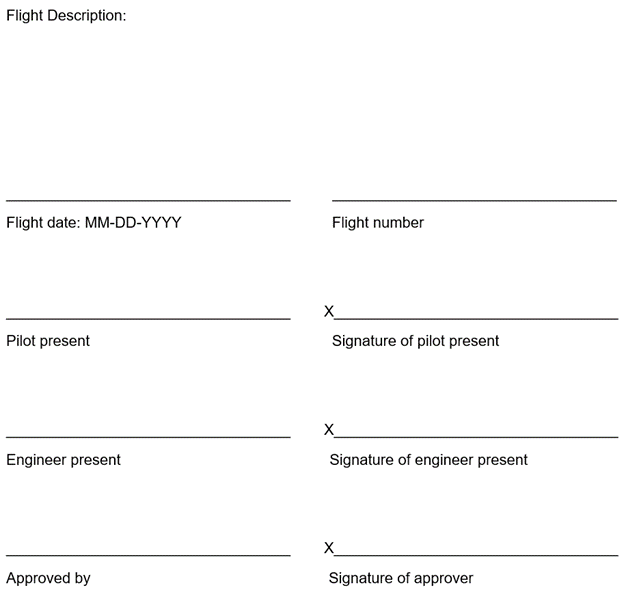

# ADEPT-FC Checklist
*Grayson Schaer\
Bretl Research Group\
Aerodynamics and Unsteady Flow Group\
ESAero\
Created: 10/28/2020 10:39 CST\
Updated: 11/05/2020 12:58 CST*

## Validation

## Materials

| Check |  Item  |  Quantity  |  Purpose/Description  | Storage Location  |
|:-----:|:------:|:----------:|-----------------------|-------------------|
||ADEPT-FC Aircraft|X1|Test aircraft|On mobile storage cart:   Upper shelf|
||Left Wing|X1|Left wing of the Adept-FC aircraft|On mobile storage cart:   Lower shelf|
||Right Wing|X1|Right wing of the Adept-FC aircraft|On mobile storage cart:   Upper shelf|
||Carbon Fiber Rod|X1|Loading bearing rod used to attach wings|On mobile storage cart:   Upper shelf|
||Wing Nut|X2|Nut used to secure wings to body|On mobile storage cart:  In plastic bag on upper shelf|
||Washer|X2|Washer used to spread load of wing nut(s)|On mobile storage cart:  In plastic bag on upper shelf|
||ADEPT-FC Aircraft|X1|Test aircraft|On mobile storage cart:   Upper shelf|
||Lipo Battery Voltage Tester|X1|Used to test the voltages of the Lipo batteries|In lipo pelican case in flammables cabinet|
||Lipo Balance Charger|X2|Used to charge lipo batteries|On workbench|
||7.4V Lipo|X5|Powers all avionics systems|In lipo pelican case in flammables cabinet|
||18.5V Lipo|X4|Powers all propulsors|In lipo pelican case in flammables cabinet|
||4-8 Power Cable Splitter|X1|Splits 18.5V connectors to 8 outputs (1 per propulsor)|On mobile storage cart:   Upper shelf|
||General Tool Set|X1|Used in assembly and repair process|Personal storage|
||HDMI Monitor|X1|Allows user to interface with Pi|On table near mobile storage cart|
||HDMI Cable|X1|Connects Pi to Monitor|Stored with monitor|
||USB Keyboard|X1|Allows user to interact with Pi|On table near mobile storage cart|
||Wireless router|X1|Creates wireless network used to interface with aircraft|On table near mobile storage cart|
||Ethernet cable|X1|Links aircraft to wireless network|On table near mobile storage cart|
||TX|X1|Sends radio commands to aircraft|In storage box on mobile storage cart|
||Linux Laptop|X1|Used to interface with aircraft via SSH|N/A|
||Weather Station|X1|Measures weather conditions at flight location|Under workbench|

## Assembly

- [ ] Remove *ADEPT-FC Aircraft* from mobile storage cart and place on ground.
- [ ] Remove both doors from *ADEPT-FC Aircraft*.
- [ ] Slide the *Carbon Fiber Rob* through the center hole of the wing root on the *ADEPT-FC Aircraft*. Avoid touching the cut-off faces of the tube as they can give carbon fiber splinters.
- [ ] With two hands distributing the load as evenly and widely as possible, lift the *Left Wing* and slide it onto the left side of the *Carbon Fiber Rod*. Pass through:
  - [ ] 4 propulsor power connectors
  - [ ] 4 propulsor PWM cables
  - [ ] 1 shielded Hall-Effect sensor servo cable
  - [ ] 1 left flap servo cable (blue tape, "LF")
  - [ ] 1 left aileron servo cable (yellow and red tape, "LA")
- [ ] Secure *Left Wing* to *ADEPT-FC Aircraft* with *Wing Nut* and *Washer*. Only finger tighten. Over tightening can damage wing root.
- [ ] With two hands distributing the load as evenly and widely as possible, lift the *Right Wing* and slide it onto the right side of the *Carbon Fiber Rod*. Pass through:
  - [ ] 4 propulsor power connectors
  - [ ] 4 propulsor PWM cables
  - [ ] 1 shielded Hall-Effect sensor servo cable
  - [ ] 1 right flap servo cable (green tape, "RF")
  - [ ] 1 right aileron servo cable (red tape, "RA")
- [ ] Secure *Left Wing* to *ADEPT-FC Aircraft* with *Wing Nut* and *Washer*. Only finger tighten. Over tightening can damage wing root.
- [ ] Attach all PWM cables from both wings (labeled 1-8) to their associated PWM ports. The ports are fixed just inside of the wing root and also labeled 1-8.
- [ ] Attach the "LA", "LF", "RA", and "RF" servo cables to the associated ports. The ports are color coded and labeled.
- [ ] Connect the *Left Wing* Hall effect sensor into the ADC riser port 1. The partially exposed face should face the right of the aircraft.
- [ ] Connect the *Right Wing* Hall effect sensor into the ADC riser port 0. The partially exposed face should face the right of the aircraft.
- [ ] Remove the nut from the ADC board riser grounding bolt.
- [ ] Attach both grounding rings from the *Left Wing* and *Right Wing* Hall effect sensors to the grounding bolt on the ADC board riser.
- [ ] Replace the nut to the ADC board riser grounding bolt.
- [ ] Inspect all batteries for any sign of external damage or swelling.
- [ ] Test battery voltages. Voltages should be no less than design voltages and no greater than 1.0V over design voltages. If voltages are incorrect, charge batteries.
- [ ] Attach the *7.4V lipo* labeled "SE 1" to the servo power distribution board power header. This is the head nearest the left side of the aircraft on the front of the PDB. **BEFORE PLUGGING IN, CHECK POLARITY**. Secure on velcro strip near front right of aircraft.
- [ ] Attach the *7.4V lipo* labeled "ProLite RX" to the servo power distribution board power header. This is the head nearest the left side of the aircraft on the back of the PDB. **BEFORE PLUGGING IN, CHECK POLARITY**. Secure on velcro strip near front right of aircraft.
- [ ] Attach the *7.4V lipo* labeled "SE 2" to the ADC board power connector. Secure on velcro strip.
- [ ] Attach the *7.4V lipo* labeled "Pi 1" to the the Pi's primary power source. Secure on velcro strip near front left of aircraft.
- [ ] Attach the *7.4V lipo* labeled "Pi 2" to the the Pi's backup power source. Secure on velcro strip near front left of aircraft.
- [ ] Attach the *4-8 Power Cable Splitter* to each of the 8 motor power connectors.
- [ ] Place 2 18.5V lipos in the nose shield of the *ADEPT-FC Aircraft*. Ensure the selected 18.5V lipos are the ones with velcro on their skinny face. Be careful not to pinch or damage the pressure transducers or their cables. **Do NOT plug in yet.**
- [ ] Place 1 *18.5V lipo* in the front of the aircraft on the center line (on a small piece of velcro). **Do NOT plug in yet.**
- [ ] Place 1 *18.5V lipo* in the rear of the aircraft off of the center lines towards the right wing (on a small piece of velcro). **Do NOT plug in yet.**

## Preflight

- [ ] Remove protective cover from 5-hole probe
- [ ] Conduct walkaround (defined in AP_Validation.md).
- [ ] Turn on TX. Check battery status of TX. If it is below 80%, charge.
- [ ] Move throttle stick all the way down.
- [ ] Set all SC switches to the fully forward position.
- [ ] Attach ethernet cable to Pi.
- [ ] Attach wireless router to ethernet cable connected to Pi. Power on the router.
- [ ] Wait for Pi to boot. If it has not booted, leave the keyboard and monitor attached and restart the device by removing and reconnecting its batteries.
- **IF WALL POWER AVAILABLE**
  - [ ] Attach HDMI cable to Pi.
  - [ ] Attach HDMI Monitor to HDMI cable connected to Pi.
  - [ ] Attach keyboard to Pi.
- **IF WALL POWER NOT AVAILABLE**
  - [ ] On linux laptop: Connect to ADEPT-FC wireless network
  - [ ] On linux laptop: `ssh 192.168.0.100`
- [ ] Login: `pi`
- [ ] Password: `*********`
- [ ] Download most recent flight release: https://github.com/tbretl/adept-fc.git
- [ ] `cd adept-fc`
- [ ] `make clean`
- [ ] `git clean -fxd`
- [ ] `make all`
- [ ] `sudo ./run.sh`
- [ ] `pwm arm`
- [ ] Check direction and throw of all control surfaces.
- [ ] Check trim command on all control surfaces.
- [ ] Check flap extension and retraction.
- [ ] Zero throttle, control surface commands, flaps, and trim. Engage autopilot and check for expected behavior.
- [ ] Zero throttle, control surface commands, flaps, and trim. Disengage autopilot.
- [ ] `pwm disarm`
- [ ] `all exit`
- [ ] `sudo ./run.sh`
- [ ] `monitor test`
- [ ] `all exit`

## Taxi

- [ ] Move aircraft to taxiway.
- [ ] Record temperature, pressure, and wind data from weather station.
- [ ] Verify wind is less than 10 MPH.
- [ ] Range check the TX.
- [ ] Plug in all 4 propulsor batteries.
- [ ] `sudo ./run.sh`
- [ ] `pwm arm`
- [ ] Conduct a fan run-up test.
- [ ] Disconnect ethernet, HDMI, and keyboard from Pi.
- [ ] Secure both doors.
- [ ] Taxi to active.

## Before takeoff
- [ ] Flaps set to takeoff.
- [ ] Trim set to takeoff.
- [ ] AP disengage.
- [ ] Flight brief.
- [ ] Clearance.

## Cruise / test
- [ ] Flaps to flight.
- [ ] Set rudder and elevator trim.
- [ ] At steady level flight, engage AP.
- [ ] Conduct test.
- [ ] Disengage AP.

## Before landing
- [ ] Ensure AP disengage.
- [ ] Trim set to takeoff.
- [ ] Flaps set to landing.

## Taxi to gate
- [ ] Flaps up.
- [ ] Trim set to 0.
- [ ] Run propulsors on low throttle for 4 minutes.

## Shutdown, lockout
- [ ] Plug in ethernet cable to aircraft.
- [ ] On linux laptop: Connect to ADEPT-FC wireless network
- [ ] On linux laptop: `ssh 192.168.0.100`
- [ ] Login: `pi`
- [ ] Password: `*********`
- [ ] `cd adept-fc/`
- [ ] Download ESC data
- [ ] `sudo ./bin/monitor`
- [ ] `pwm disarm`
- [ ] `all exit`
- [ ] `sudo poweroff`
- [ ] Disconnect propulsor batteries.
- [ ] Disconnect ADC battery.
- [ ] Disconnect both servo power distribution batteries
- [ ] Disconnect both flight computer batteries.
